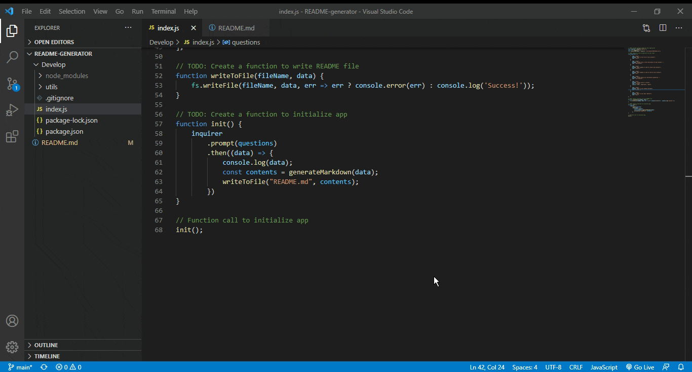

# README Generator

## Description of Project
Every repository should have a thorough, easy-to-navigate README.  Unfortunately, putting one together takes time.  To save time, this application generates the bulk of the markdown needed for your README and fills in the gaps based on user input!

Once prompted, enter a project description, license information, installation and usage instructions, contact information, and next thing you know - your README is ready to go!

## Table of Contents

- [Usage](#usage)
- [Credits and Code Used](#credits-and-code-used)
- [Application Demo](#application-demo)
- [Questions](#questions)
- [Takeaways](#takeaways)

## Usage
To run the program, type the following command in your terminal:

```bash
node index.js
```

## Credits and Code Used

- Javascript/ES6
- Node.js
- npm inquirer package

## Application Demo



## Questions
Check out my GitHub profile [here.](https://github.com/smcmillan28)

Feel free to send me an email, as well: smcmillan1991@gmail.com

## Takeaways
So far, I have enjoyed learning the fundamentals of back-end programming.  The three primary takeaways from this project are:

- Writing command-line applications with Node.js
- Interacting with the file system using require(fs) as an identifier 
- Using the inquirer package to gather user data through a series of prompts